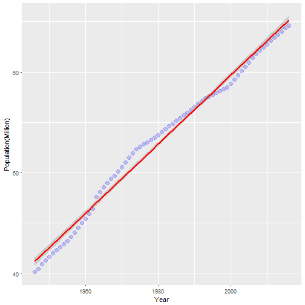

French Population 2016
========================================================
author: Aptyos
date: 2017-02-19 


Summary
========================================================
- In France, administrative areas are organized in "Regions"  which are subdivided in "Departments" and then in "Communes".
- There are 95 departments in metropolitan France.
- Data, up to date to January 2017, was retrieved from the French National Institute of Statistics and Economic Studies [INSEE](https://www.insee.fr/en/accueil) to present French population in different administative areas of the territory.
- The application maps the population number and density within each department.

>- [Application URL](https://aptyos.shinyapps.io/FRPOP/)
 
>- [GitHub URL containing source files](https://github.com/Aptyos/FRPOP)


Choosing a Department
====================================

A department is accessed by clicking the drop-down list arrow 
at the right of the selection field.


***
Once done click on the "submit" button


Some characteristics of the department will be displayed in the left tab while the map is recentered toward the main city of the choosen department.


Population, Main City and Density
==================================================

If a click is pressed on the blue delimitered area of the department a popup appears displaying the main city and the total number of people in the department.

***
It is also interesting to know the population density (pop/km ). To get it the check box must be selected and the submit button pressed.


Population Growth Rate: 1946 - 2017
===========================================


<font size=2>

```r
g <- ggplot(data = frGrowth, aes(x = year, y=total/1e6)) + geom_point(size =3, colour = "blue", alpha=0.2)
g <- g + xlab("Year") + ylab("Population(Million)") + geom_smooth(method = "lm", colour = "red"); g
```



```r
fit <- lm(total ~  year, data= frGrowth)
paste("In Year 2020 we'll be:",round(predict(fit, newdata = data.frame(year=c(2020))),0 ))
```

```
[1] "In Year 2020 we'll be: 66538802"
```

```r
paste("In Year 2050 they 'll be:",round(predict(fit,newdata = data.frame(year=c(2050))),0 ) )
```

```
[1] "In Year 2050 they 'll be: 76806117"
```
</font>


